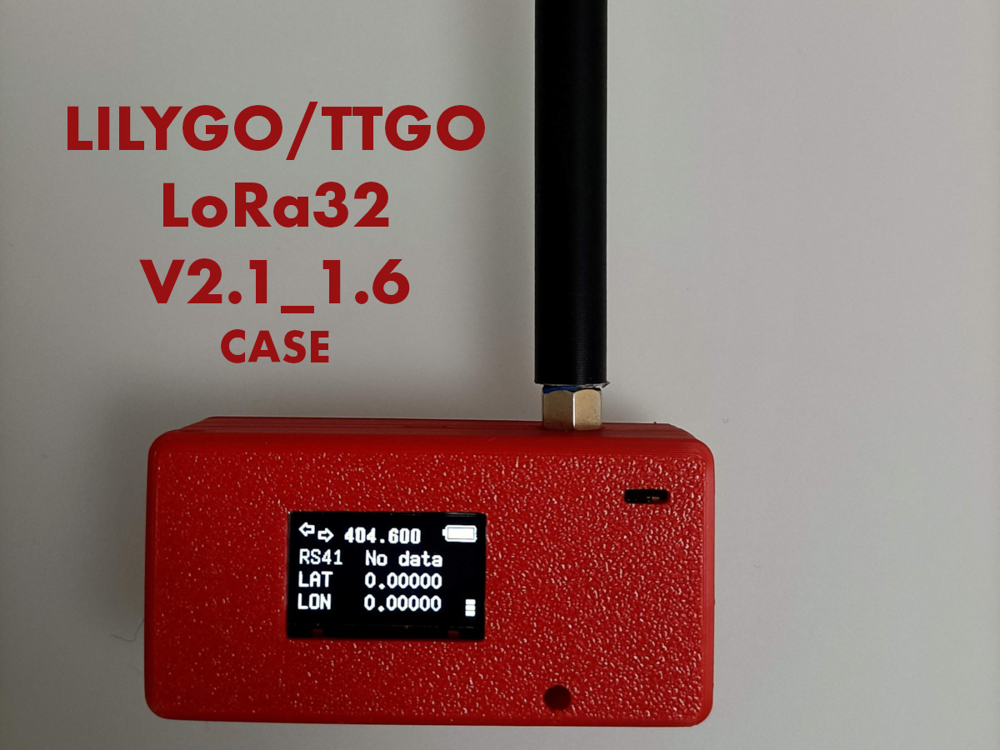

# Enclosure for the LILYGO/TTGO LoRa32 V2.1_1.6 Board

This
[ESP32-based board with a LoRa chip](https://www.lilygo.cc/products/lora3)
is used in many projects, including:

- [TinyGS](https://tinygs.com/)

- [Meshtastic](https://meshtastic.org/)

- [MySondy GO](https://mysondy.altervista.org/mysondygo.php)

and many more.

The [OpenSCAD](https://openscad.org/) source uses the fantastic
library
[YAPP_Box Yet Another Parametric Projectbox generator](https://github.com/mrWheel/YAPP_Box)
to create an enclosure for this small board, with space for an optional rechargeable battery.

The main features of this enclosure are:

- **Tightly assembled** with USB, SD and antenna connectors easily
  accessible.

- The **LEDs are easily visible** through small holes in the
  enclosure.

- The **power switch on the bottom** is easily accessible with a
  finger.

- The **display is cleary visible**.

- There are **dedicated holes** for attaching a string.

- **No screws needed**; the *snap-joint* design allows the base and
  lid to "click" together without screws.

- The **circuit board is neatly clamped** between the base standoffs
  and the lid push-downs, ensuring correct alignment, thanks to the
  antenna connector holder.

- A dedicated space for an **optional rechargable battery** with
  dimensions of of 4 cm x 3 cm x 0.9 cm.

In the [3dmodel](3dmodel/) folder, you will find:

- The 3D STL model.

- The `.3mf` file, created by *Bambu Lab Studio*, which contains the
  3D model and the *print profile* with the printing parameters I used
  on my *Bambu Lab A1* printer.

In the [img](img/) folder you will find additional images of the enclosure.

# Notes

- To close or open the enclosure, gently press the base near the snap
  joints (in the center) with your fingers to facilitate the process,
  or use a small flathead screwdriver to free the lid from the
  joints. Be careful not to bend the lid during removal or insertion
  to avoid breaking the standoffs.

  
